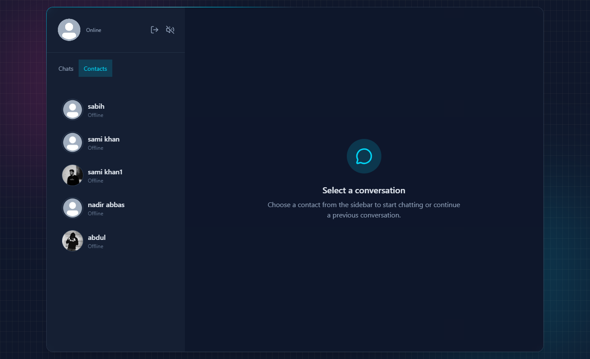
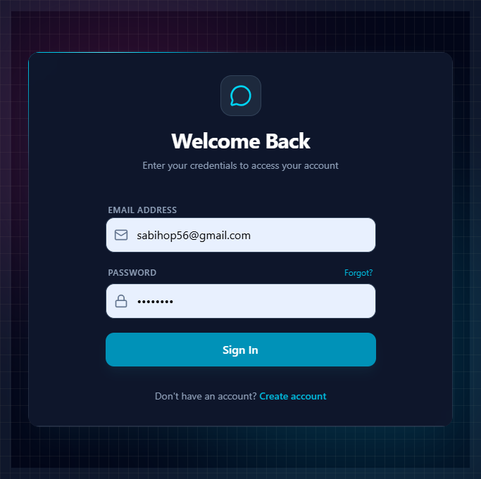
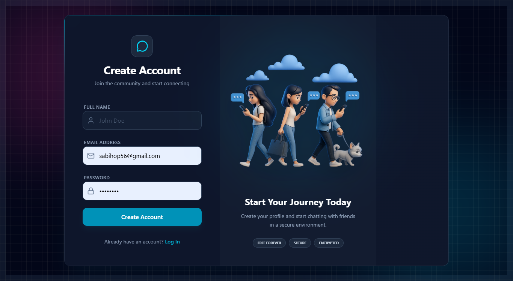
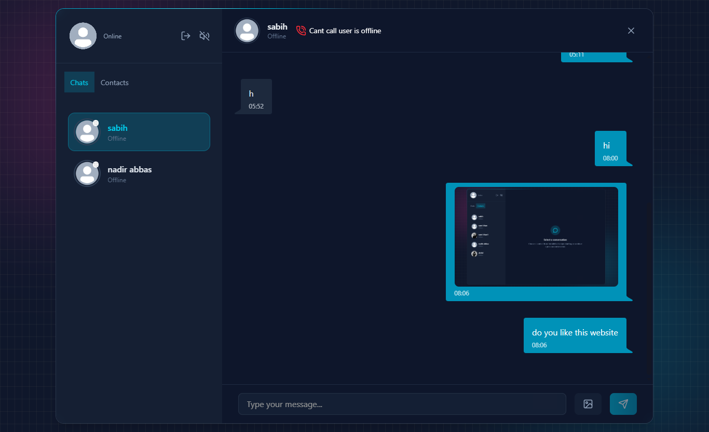
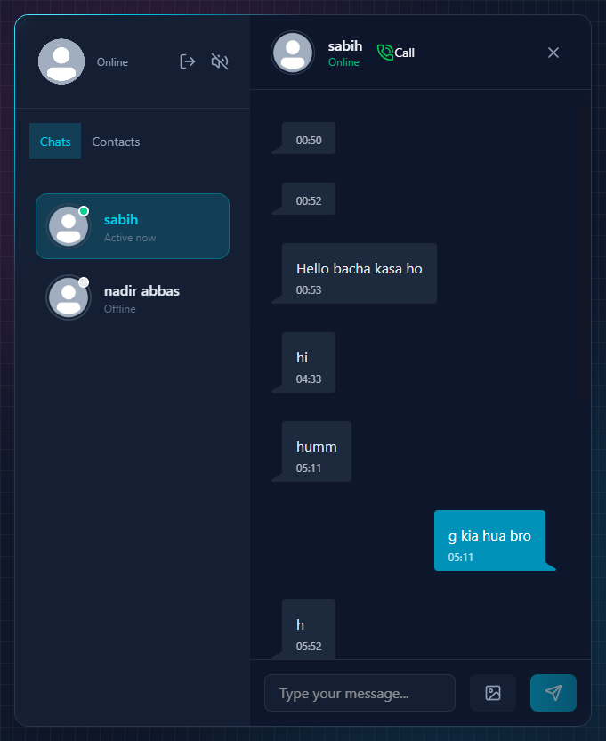
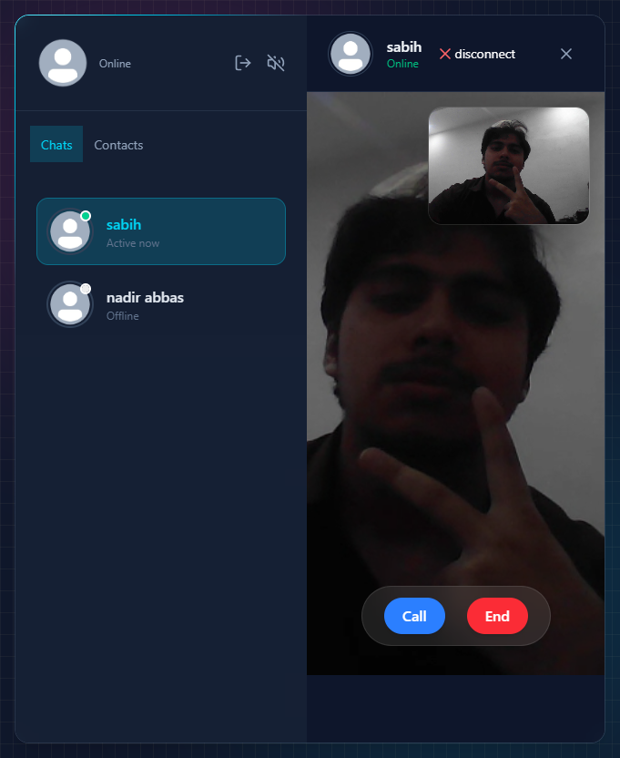

# ChillChat (Real-Time Chat + Video Calls)

ChillChat is a full-stack chat application with real-time messaging and 1-to-1 video calling.
It uses **Socket.IO** for real-time messaging and signaling, **WebRTC** for video calls, and **JWT (cookies)** for authentication.

## Screenshots

### Authentication




### Chat



### Video Call


## Features

- User authentication (Signup/Login) using JWT stored in cookies
- Contact list + chat history
- Real-time text messaging with Socket.IO (`newMessage`)
- 1-to-1 video calling using:
  - `RTCPeerConnection` + STUN
  - Socket.IO signaling events: `offer`, `answer`, `ice-candidate`, `incoming-call`
- Media support:
  - Profile picture updates
  - Chat message images via Cloudinary
- Security tooling:
  - Arcjet middleware for rate limiting and bot detection

## Tech Stack

Client:
 React
 Vite
 JavaScript
 Tailwind CSS
 daisyUI
 Socket.IO client
 Zustand
WebRTC (browser APIs)

Server:
 Node.js
 Express
 Socket.IO
 MongoDB (Mongoose)
JWT (via `jsonwebtoken`)
Cloudinary (media storage)
Arcjet (security middleware)

## How Video Calling Works (High Level)

1. Caller opens the calling screen and creates an SDP offer:
   - `RTCPeerConnection.createOffer()`
2. Caller sends the offer through Socket.IO (`offer`).
3. Receiver sets the offer as remote description and creates an answer:
   - `RTCPeerConnection.createAnswer()`
4. Receiver sends the answer through Socket.IO (`answer`).
5. Both peers exchange ICE candidates through Socket.IO (`ice-candidate`) until the media connection is established.

## Project Structure

```txt
chatapp/
  client/   # React + Vite frontend
  server/   # Express + Socket.IO backend
  photos/   # screenshots used in this README
```

## Setup & Run

### Prerequisites

- Node.js installed
- MongoDB connection string
- JWT secret
- (Optional) Cloudinary credentials (if you use image features)
- (Optional) Arcjet + Resend keys (if you use those features)

### 1) Install dependencies

From the project root:

```bash
npm install --prefix server
npm install --prefix client
```

### 2) Configure environment variables

Create `server/.env` with at least:

```bash
PORT=3000
CLIENT_URL=http://localhost:5173
JWT_SECRET=your_jwt_secret
Moongose_URI=mongodb://localhost:27017/your_db

# Cloudinary
cloudname=your_cloud_name
cloudapikey=your_cloud_api_key
cloudsecret=your_cloud_api_secret

# Arcjet
arjetkey=your_arcjet_site_key

# Resend (if used)
resend_api_key=your_resend_api_key
EMAIL_FROM=your_verified_sender_email
```

### 3) Start the server

```bash
npm run dev --prefix server
```

### 4) Start the client

```bash
npm run dev --prefix client
```

## API Notes

- Auth endpoints: `/api/auth/*`
- Chat endpoints: `/api/messages/*`
- Real-time events include:
  - `incoming-call`, `offer`, `answer`, `ice-candidate`, `getOnlineUsers`, `newMessage`

## Contributing

If you find a bug (especially around WebRTC negotiation), open an issue with:
- browser console logs
- server logs
- exact steps to reproduce
